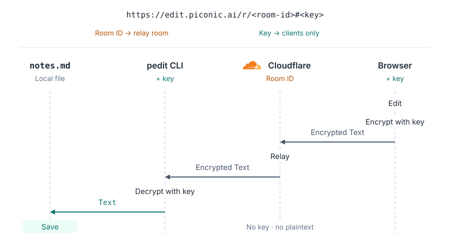

# pedit — Pair edit your local files.

`pedit` is a CLI that lets people edit your local files together in their
browsers. Edits are saved back to your file:

```text
❯ pedit notes.md

  notes.md is ready to write together.

  Send this link to the people you want to invite:
    https://edit.piconic.ai/r/<room-id>#<key>
```

No install or account needed for collaborators on the public server.

## Why pedit?

Local files work naturally with coding agents and your own editor. Keeping
documents in Git makes changes reviewable and preserves their history, but
asking someone to clone a repository and open a pull request adds friction
to a quick editing session.

pedit lets you invite people into the file with a link and edit together in
their browsers. They do not need to set up your development environment.
The edits land in the same local file, ready for your next agent task,
review or commit.

## Install

Download a binary from [GitHub Releases](https://github.com/piconic-ai/edit/releases),
extract it and put `pedit` (`pedit.exe` on Windows) on your `PATH`.
macOS, Linux and Windows · amd64 and arm64 · no runtime dependencies.
SHA-256 checksums are included in `checksums.txt`.

Or with Go 1.25+:

```sh
go install github.com/piconic-ai/edit/cmd/pedit@latest
```

## Privacy and security



This is a simplified illustration: pedit encrypts document updates rather than
raw text. The relay sees the room ID and encrypted bytes, but not the key.
Edits in the opposite direction follow the same process.

- **End-to-end encryption.** Document updates and pasted images are encrypted
  on your devices. The relay receives ciphertext; the key stays in the link's
  `#fragment` and is never sent to the server.
- **Local files, temporary sessions.** The relay does not store document text.
  The relay attempts to delete encrypted images when the host leaves; a
  one-day bucket lifecycle rule handles failed deletions. Removal is not immediate.
- **The link grants editing access.** Anyone with the full link can read and
  edit during the session. Share it only with people you trust. Closing a
  session does not erase copies participants have made.
- **Your relay, your access rules.** Use the public relay at `edit.piconic.ai`,
  or [self-host](#self-host) to require sign-in with Cloudflare Access.

You must trust the relay operator to serve the intended browser editor, and
trust participant devices and browsers. A modified editor could read the key
and plaintext. Infrastructure can see IP addresses, room IDs, request timing
and ciphertext sizes; infrastructure and Access logs have separate retention
settings and are not erased when a room closes.

Markdown previews can request external images, videos and embeds. With Access,
avatars may load from an identity provider or Gravatar using an email hash.
Those providers can see the requests.

## Self-host

Self-host when you want to limit who can join editing sessions. Cloudflare
Access lets you allow specific email addresses or identity provider groups;
participants need both an allowed identity and the session link.

[](https://deploy.workers.cloudflare.com/?url=https%3A%2F%2Fgithub.com%2Fpiconic-ai%2Fedit%2Ftree%2Fmain%2Fpackages)

The button copies only the server workspace (`packages/`), without the Go CLI.
Deploy the relay and browser editor to your Cloudflare account, then:

```sh
PEDIT_SERVER=https://<worker>.<subdomain>.workers.dev pedit notes.md
```

See [self-hosting notes](docs/self-hosting.md) for requirements and Access setup.

## Contributing

See [CONTRIBUTING.md](CONTRIBUTING.md) for development setup and pull requests.
